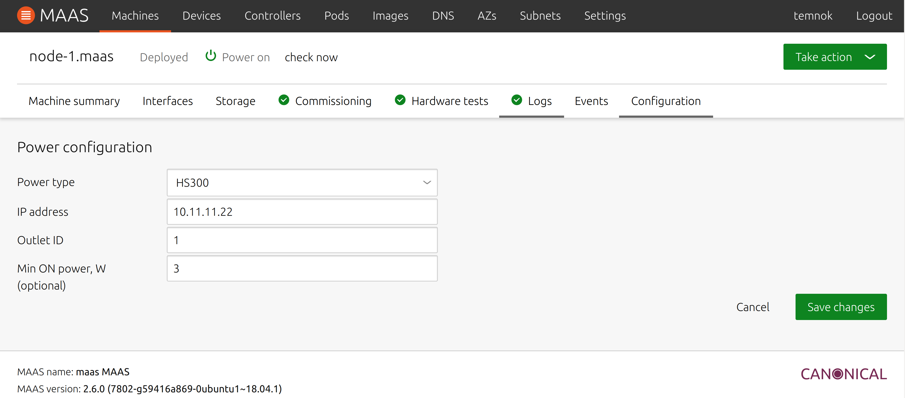

# MAAS Power Driver for HS300 Smart Power Strip

### Features:
* Power on
* Power off
* Power querying
* Optional power-off on querying if machine was turned off manually
  and power usage fell below the specified threshold

> _Power on_ feature will work only if machine's BIOS has `Restore after AC Power Loss` option set to `Power On`

> This driver has been tested on MAAS 2.6.0.

Install the driver as below:
```sh
git clone https://github.com/temnok/hs300-maas
cd hs300-maas
DRIVER_DIR="/usr/lib/python3/dist-packages/provisioningserver/drivers/power"
sudo patch -d ${DRIVER_DIR} -p5 < hs300.patch
sudo service maas-regiond restart && sudo service maas-rackd restart
```

Alternatively, you can simply copy `hs300-maas.py` file to `/usr/lib/python3/dist-packages/provisioningserver/drivers/power`
directory and add `HS300PowerDriver` to `drivers/power/registry.py` file manually.


